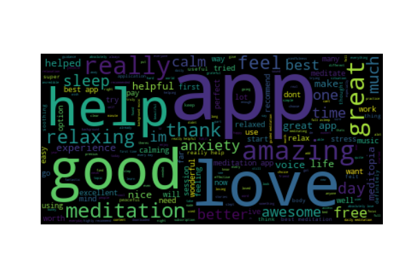
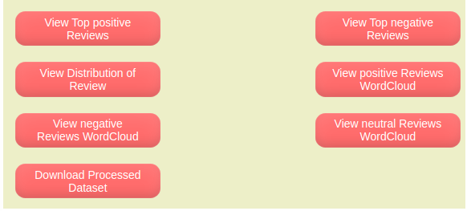
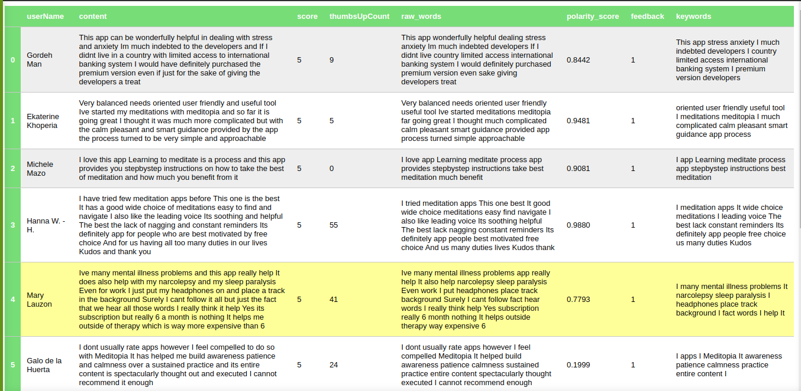
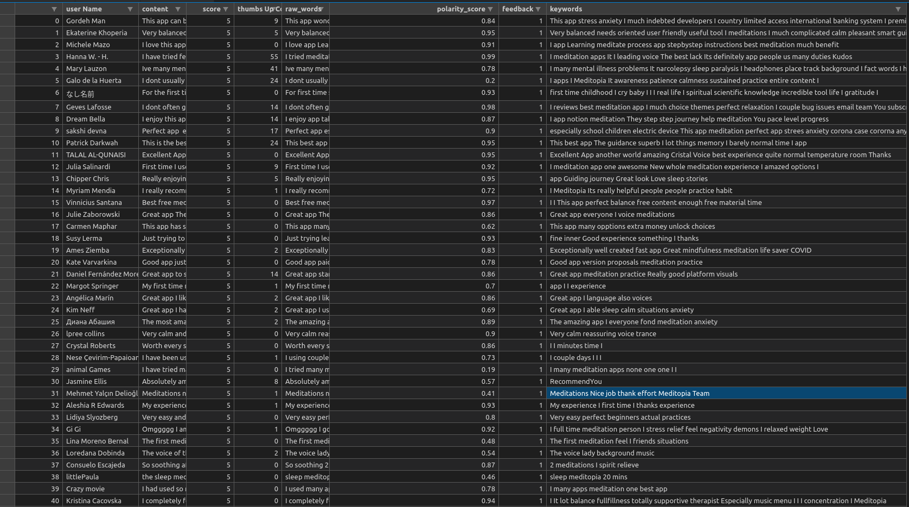

#  Team TVA

## Application Description

A Web Tool that allows users to View processed and Analyzed User Feedback Data

## Table of Contents

- [Team TVA](#team-tva)
  - [Application Description](#application-description)
  - [Table of Contents](#table-of-contents)
  - [Demo](#demo)
  - [Screenshots](#screenshots)
  - [Technology Stack](#technology-stack)
  - [Features](#features)
  - [Running](#running)
  - [Usage](#usage)
  - [Collaborators](#collaborators)
  - [License](#license)


## Demo

A Short Video Detailing the Features Implemented in this Application

View the Demo on [Google Drive]([https://drive.google.com/drive/folders/1jap2JqZrqMUH6DmNBICMZNLiq6ZSBQV0?usp=sharing])


## Screenshots







## Technology Stack

| Technology | Description                               |
|------------|-------------------------------------------|
| HTML5      | Hyper Text Markup Language                |
| CSS3       | Cascading Style Sheets                    |
| Python     | High Level, Dynamic, Interpreted Language |
| Docker     | Open source containerization platform     |
| NLTK       | Text processing library                   |
| Spacy      | Natural Language Processing               |
| Pillow     | Python Imaging Library                    |
| Pandas     | Data Analysis and Manipulation Library    |
| Numpy      | Data Analysis and Manipulation Library    |
| Vader      | Sentiment Analysis Library                |
| Matplotlib | Data Visualization Library                |

## Features

1. This Application Allows users to classify and analyze their product feedback.
2. The scope and scalalibity of this application is huge in the sense that any user can simply change the input data and be able to use the app 
3. The feedback is segregated on sentiment analysis, word repetition and Natural Language Processing, etc.

## Running

To test the application run the following commands on your terminal:

**Running the application locally:**

```
pip install -r requirements.txt
python app.py
```

**On docker:**

```
docker-compose up --build
```

## Usage

Visit http://localhost:5000 on a Browser to View the App

## Youtube Link:


## Collaborators

| Name                | Link ↘️                          |
|---------------------|---------------------------------|
| Talha Abdur Rahman  | https://github.com/Talha-Altair |
| Vedha Sankar        | https://github.com/VedhaSankar  |
| Sandra Ashipala     | https://github.com/sajustsmile  |


## License

GNU GENERAL PUBLIC LICENSE Version 2, June 1991